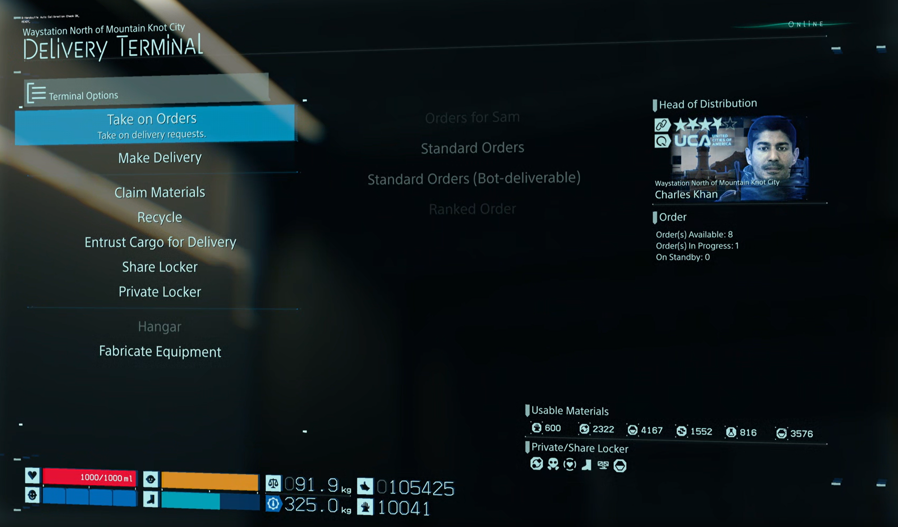
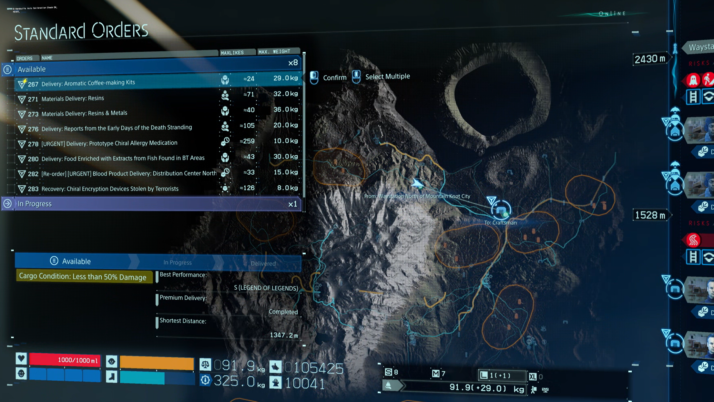
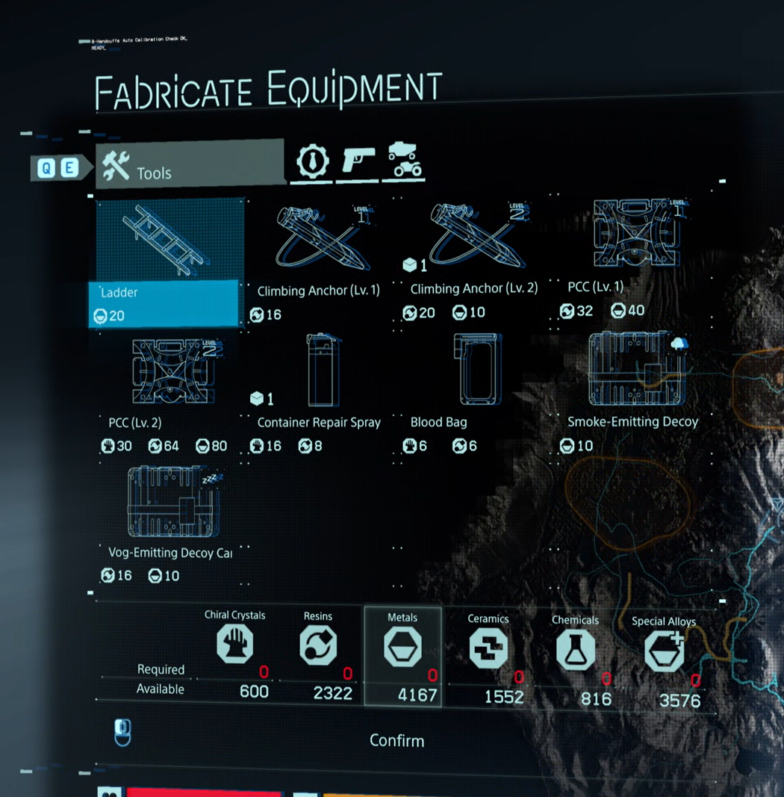
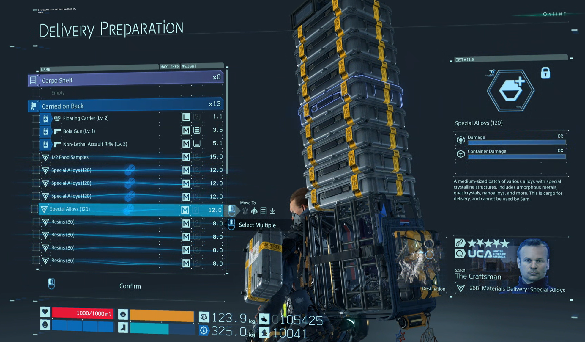
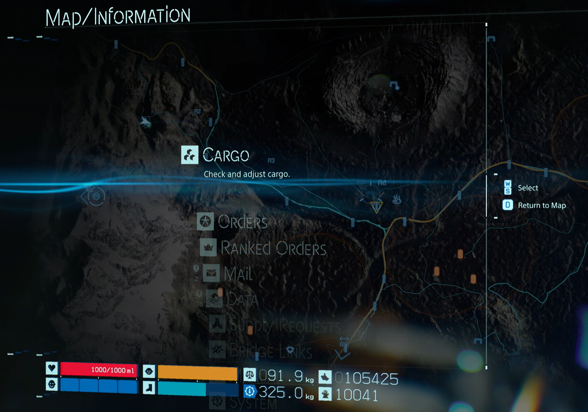
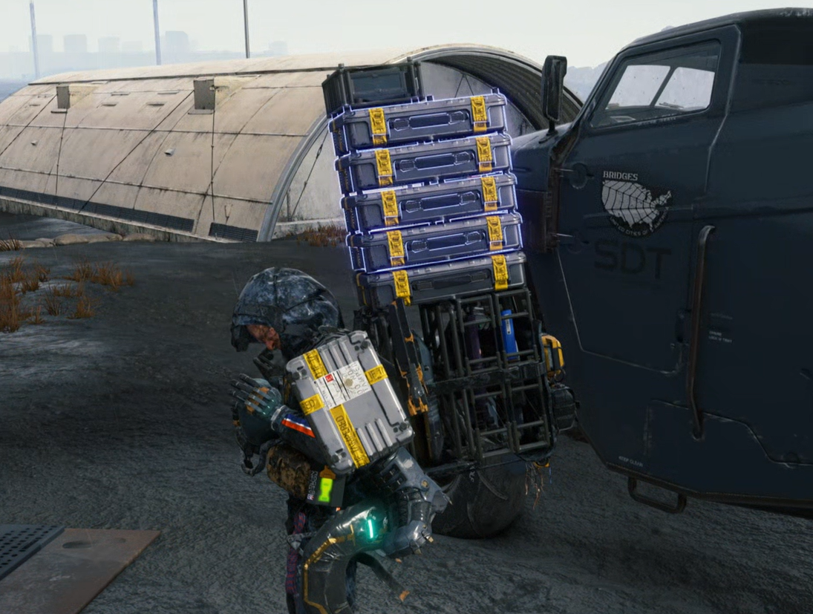

# Using the Menus to Complete a Delivery in Death Stranding
### Jared Duron
### 11/22/2024

Death Stranding is a game where you play as a delivery person, and you need to travel large distances to take or deliver orders. Because of this long distance travel, you need to plan out the delivery by taking tools that can help you on your journey, drawing out a travel route, and deciding how much you'll bring since there is a weight limit that the player character can hold. Planning is extremely important in the game as you do not want to damage the cargo you're delivering as this can give you a bad grade, and there are many things in the game that can hurt the cargo or hurt you. Enemies in the game (such as terrorists and BTs), falling due to bad terrain conditions, and staying out in the rain (or timefall as it's called) will drastically reduce the quality of the cargo, so planning is of the essence. Most of the game involves the player taking orders and planning routes to successfully deliver packages to clients that request them. There are also some combat aspects to the game, but I’ll be focusing on the delivery aspect. For the player to properly plan a delivery, they need to navigate through many menus to take on orders, make tools, and use the map to create a route. Some goals that occur during regular gameplay therefore include accepting orders, adequately preparing before doing the delivery to have a higher success rate, and delivering the packages. \
&emsp; When taking on orders and gathering items to help the player’s delivery, the menu options are clearly labeled, and they contain subtitles to explain to the player what the purpose of the options are for. Some of the menu options contain submenus to avoid overwhelming the user with all of the options for them to choose. To start a delivery, I would need to press the “Take on Orders” button and choose what type of order I want.

How the menu looks when taking on an order. The submenu options could be grayed out to signify that a certain type of order isn't available.

The game makes it **efficient** to take on an order and prepare by giving me the option to make items that would be useful for my journey and organize the cargo for delivery, so I don’t have to manually go to that menu myself. In addition, the game shows me the orders I’m currently working on so as to not go overboard with the deliveries as there is a weight limit to how much the player character can carry.

This is a list of orders that can be accepted. The right-hand side shows the current orders to the player (a button needs to be pressed to fully see the current orders). The bottom shows the players stats to show how capable they are for the order. The location of the destination is also shown with respect to the player character.

The "Fabricate Equipment screen is shown next to let the player create any tools that they may need to do the delivery successfully. Along with symbols to show the user what is being made and what materials are needed, there are names to complement the symbols to ensure that the player knows what they are.

Finally, the "Delivery Preparation" screen is shown to organize the cargo. Either one piece of cargo or multiple pieces can be selected to move it around, making the preparation more efficient.

However, an issue with this convenience is that these menus contain tons of information, which can be overwhelming to new players and may not be obvious what information they convey. The game tries to take off some of the burden from the players by walking them through what all of the information on the screen means, but I think this can be improved by containing a button that takes the players to the in-game manual that contains more information depending on what they’re looking at. \
&emsp; After an order is accepted, I do some more preparation by going into the map and plotting my route to the destination. This stage of preparation is optional as I don’t need to plot the route on my map (which is good as it lets players play how they want to play), but doing this is **effective** in getting a good rating for my delivery as there is terrain that could lead to the cargo being damaged if I’m not careful. To plot the route in my map, I hold a button to and drag it out to make a line that connects two points. I make multiple of these connections to show the full path to my destination as I can see the lines during gameplay.

<video src="assets/map_route.mp4" width="1000" autoplay loop muted></video>
This is how a route can be plotted on the map. The route can be seen in gameplay and guides me to my destination.

There is also a menu alongside the map to remind players what cargo they have, where they are taking it, etc. to further improve the effectiveness.

One thing that can be improved to make this more effective is making the paths that can be drawn out less rigid by still using the same controls of holding the button down and dragging the lines, but it should be more like a drawing mechanic where the player can draw out paths of any shape instead of just straight lines. To ensure that my delivery is of adequate quality, there are menus and other information alongside the map to make the delivery process more effective by giving information about the cargo, where I need to deliver it, and a weather forecast as rain needs to be avoided since it damages the cargo. \
&emsp; Once I reach the destination, all that’s left is to give the specific cargo tied to the order. There are two different types of cargo that can be delivered: cargo received from an order and lost cargo. Delivering the cargo is very similar to accepting an order as I traverse through the same menu as when taking on an order. One small issue that I have is that delivering lost cargo and cargo from an order at the same time leads to both being delivered when I don’t want that to occur. There are separate menus to deliver cargo from an order and lost cargo, but it doesn’t seem to matter as both get delivered simultaneously anyway. Besides that, this process is quite easy to understand as the game shows **feedback** by highlighting which cargo is going to be delivered depending on the station that I approach. This is helpful when taking on multiple orders at the same time.

This is how the cargo appears when I approach the destination. This feedback shows which cargo in particular I will deliver. The other cargo that is not highlighted will remain on the player character's person.

<video src="assets/delivery.mp4" width="1000" autoplay loop muted></video>
Navigating the menu to finish the delivery. It's the same menu as when taking on an order, but the game will place the user at the "Deliver Requested Cargo" option by default to make this process easier. The cargo is also shown on the right to show specifically which cargo is being given. In addition, the game shows the rating that I got and lists the criteria to justify the grade, which adds to how well the game gives feedback. However, it's not shown in this clip.
